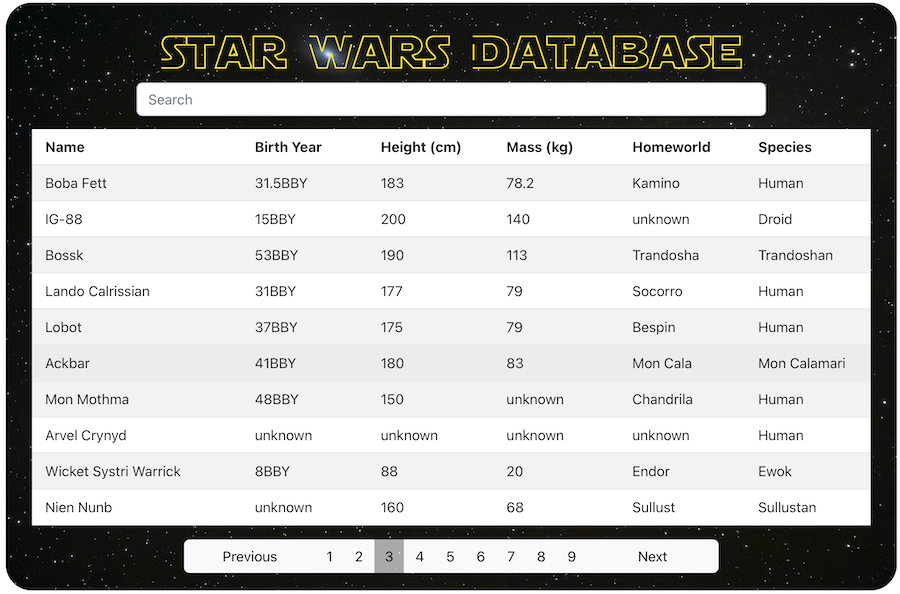

# Star Wars Data App

 

_A web app that pulls Star Wars character data from (SWAPI)[https://swapi.dev] (Star Wars API) and presents it using React and Bootstrap components._

 

See it in action [here](https://nicks-star-wars-data-app.herokuapp.com).

 

Screenshot: 

## Summary

Features:

-  A search bar that uses the API's search functionality to find characters by name. The search bar actively searches while typing.
-  A custom Pagination bar to navigate through the data more easily
-  Mobile-friendly view hides pagination and allows table scrolling

What I learned: 

-  This project helped me get to know a lot more about React Hooks and their different uses
-  How to use aysnc and await to get api data appropriately
-  How to utilise multiple states to keep the app's renders minimal and maintain efficiency

## Author

-  **Nick Schaefer** - _Full-Stack Software Developer_ - [Website](https://nschaefer.com/) | [LinkedIn](https://www.linkedin.com/in/nick-n-schaefer)
